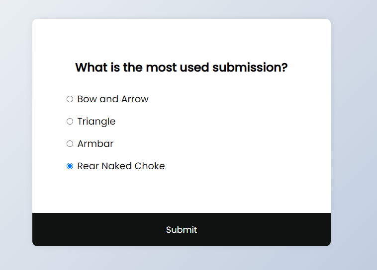
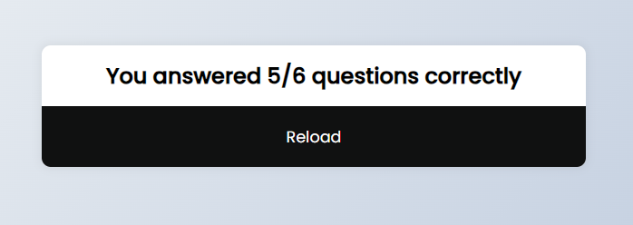

# Brazilian Jiu Jitsu Quiz
Welcome to the Brazilian Jiu Jitsu Quiz! This quiz is designed to test your knowledge of the martial art of Brazilian Jiu Jitsu and the champions of ADCC.
Live link!
https://filipljung.github.io/quiz.site.github.io/

## Project Goals
* [User Goals](#User-Goals)
* [Company Goals](#Company-Goals)

## User Experience(UX)
* [Ideal User](#Ideal-User)
* [User requirements and Expectations](#User-Requirements-and-Expectations)
* [User Stories](#User-Stories)

## User Interface(UI)
* [User Interface](#User-Interface)

## Design 
* [Chosen Design](#Chosen-Deisgn)
* [Wireframes](#Wireframes)
* [Color](#Color)
* [Fonts](#Fonts)
* [Structure](#Structure)

## Deployment Method
* [How to Deploy](#How-to-Deploy)

## Technologies Used
* [Technologies Used](#Technologies-Used)

## Introdcution
- The quiz is website intended for passionate Jiu jutsi enthusiasts and those who are about to become one. It is an imaginary company but with the intention for someone to use the content of Yoga site maybe as an idea to make imaginary come to life and make yoga community expand. With that thought I'm inviting you to join me on a virtual journey of making Yoga. Targeted user is any adventurous person aged 0-120yrs who is willing to learn and enjoy life and want to learn more about jiu jutsi trough this website Quiz. 

## User Goals

To find a Individual to learn how to Learn quick, efficient and, safe
See clearly full range of what company offers
Clear Questions with a lot of information
Easy to find information about jiu jutsi
Clearly displayed location of jiu jutsi
Clearly displayed information how to get in touch with the Business
Have a few options how to get in touch and connect.

## Company Goals 

- Promote and Jiu jutsi
- Attract more and increase the number of Talents that we can get from this
- Expand the business
- Provide expected service to all types of Video instructionals
- Provide quick and easy to find information about buisness to potential clients to collab with
- Ensure to have a clear distinction from competitors
- Bring value to Jiu jutsi competetors and market

## User Experience
Preferred type of user who would benefit from visiting this website and vice versa is

- New user with interest in Jiu jutsi and wanna learn
- Hard-core or experienced jiu jutsi guys and girls
- Returning user happy with value and service business provided

## User Requirements and Expectations
- Simple and well-structured content
- Intuitive and Simple Navigation System
- Functionality of Website(everything working as expected)
- Visually appealing design with good presentation
- Accessibility regardless of device and screen size
- Easy and simple way to start and see result of the quiz

## User Stories
* New (First-time) User
- As a New User, I want to easily navigate the entire website intuitively.
- As a New User,I want to know what the company offers.
- As a New User,I want to know the price of the services that company offers.
- As a New User,I want to know the best and quickest way to contact the company.
- As a New User,I want to know where the company is located.
- As a New User,I want to know how long does the company exist.
- As a New User,I want to know what does it look like to use one or more of the services.

## Returning User 

- As a returning user,I need the information im looking for to be easy to find as I remember.
- As a returning user,I want to always be no more than 3 clicks away from contacting the company or returning to a starting position.
- As a returning user,I want to find and connect with company on social media.
- As a returning user, I want to know more about the team that will possibly train me.
- As a returning user,I want to see all options that are available to me.
- As a returning user,I want to be pleased with website functionality so I can recommend it to my friends

## User Interface
Sample Question and Score:

## How I Deployed
- For deployment to GitHub I simply created a new repository.
- Named my repository: "quiz.site.github.io".
- Uploaded the project into my repository.
- Enabled GitHub pages by simply going to repository's "Setting" tab.
- Scroll down to "GitHub pages" section.
- Under the "Source" dropdown i selected the main branch.
- Voila! A live link for the project is generated by GitHub in form of a URL.

## Acknowledgements

- This project was inspired by A video tutorial
- This project was based on [this tutorial] (https://gamedevacademy.org/javascript-quiz-tutorial/).
- Many thanks to https://www.w3schools.com/ And web dev simplified and my mentor can!

## Technologies Used

- HTML5
- CSS
- Javascript

- Gitpod
- Github
- Git
- Font Awesome
- Google Fonts

## Contact
Created by [@filipljung](@github.com/filipljung) - feel free to contact me
